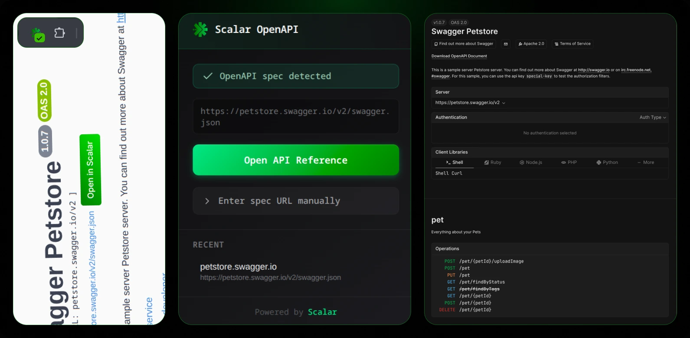

<h1> Scalar OpenAPI Viewer</h1>

A Chrome extension that detects OpenAPI specifications and renders them using [Scalar's](https://scalar.com) beautiful API reference UI.



## Features

- **Link Detection**: Finds `swagger.json` links on any webpage and adds an "Open in Scalar" button next to them
- **Popup Status**: Shows whether the current page has an OpenAPI spec available
- **Manual URL Input**: Enter any OpenAPI spec URL directly from the popup
- **Beautiful Viewer**: Renders API documentation using Scalar's modern interface with sidebar navigation, request examples, and more

## How It Works

1. **Content Script** scans pages for links ending in `swagger.json` and injects "Open in Scalar" buttons
2. **Popup** displays detection status and provides quick access to the viewer
3. **Viewer** opens in a new tab and renders the OpenAPI spec with Scalar's API Reference

## Installation

### From GitHub Releases

1. Download the latest release from the [releases page](../../releases)
2. Extract the zip file
3. Open Chrome and navigate to `chrome://extensions/`
4. Enable **Developer Mode** (toggle in top right)
5. Click **Load unpacked** and select the extracted folder

### Development

```bash
# Install dependencies
npm install

# Build the extension
npm run build

# Development mode with auto-rebuild
npm run dev
```

Then load the `dist` folder in Chrome:
1. Open `chrome://extensions/`
2. Enable "Developer mode"
3. Click "Load unpacked"
4. Select the `dist` folder

## Usage

- **On API documentation pages**: Look for the green "Open in Scalar" button next to `swagger.json` links
- **Via popup**: Click the extension icon to check status or enter a spec URL manually
- **Direct URL**: Open the viewer with any OpenAPI spec URL using the manual input

## Project Structure

```
├── public/
│   ├── manifest.json     # Chrome extension manifest (v3)
│   └── icons/            # Extension icons
├── src/
│   ├── background.ts     # Service worker for messaging
│   ├── content.ts        # Injects buttons on web pages
│   ├── components/       # Shared React components
│   ├── lib/              # Utilities
│   ├── popup/            # Extension popup UI
│   └── viewer/           # Full-page API reference viewer
├── popup.html            # Popup entry point
└── viewer.html           # Viewer entry point
```

## Tech Stack

- TypeScript
- React 18
- CSS Modules
- Vite
- Scalar API Reference React

## License

MIT — Do whatever you want with it, but contribute back if possible.
